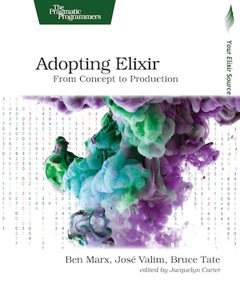

[](https://gitpitch.com/enogrob/ebook-project/master)
```
Roberto Nogueira  
BSd EE, MSd CE
Solution Integrator Experienced - Certified by Ericsson
```
# eBook Adopting Elixir



**About**

__From Concept to Production
by Ben Marx, José Valim, Bruce Tate__

Adoption is more than programming. `Elixir` is an exciting new language, but to successfully get your application from start to finish, you’re going to need to know more than just the language. You need the case studies and strategies in this book. Learn the best practices for the whole life of your application, from design and team-building, to managing stakeholders, to deployment and monitoring. Go beyond the syntax and the tools to learn the techniques you need to develop your Elixir application from concept to production..

[Homepage](https://pragprog.com/book/tvmelixir/adopting-elixir)

## Topics
```
[ ] Introduction
Three Adoption Stories
[ ] icanmakeitbetter is Acquired
[ ] Bleacher Report Improves Performance and Reliability
[ ] Plataformatec Supports Early Adopters
[ ] Embracing End-To-End Adoption
[ ] Wrapping Up
Concept
Team Building
[ ] Training Developers
[ ] When Things Go Wrong
[ ] Hiring Elixir Developers
[ ] Conducting Interviews
[ ] Wrapping Up
Ensuring Code Consistency excerpt
[ ] Coding Standards
[ ] Typespecs and Dialyxir
[ ] Documentation
[ ] Tests and Code Coverage
[ ] Putting It All Together: Code Reviews
[ ] Wrapping Up
Legacy Systems and Dependencies
[ ] Replacing a Legacy Web App
[ ] Terraform and API Evolution
[ ] Moving Incremental Releases into Production
[ ] Umbrella Projects: Between Monoliths and Services
[ ] Managing Third-Party Dependencies
[ ] Wrapping Up
Development
Making the Functional Transition excerpt
[ ] Elixir vs. Mutable Objects
[ ] Polymorphism
[ ] Agents and Tasks
[ ] The Generic Server
[ ] Supervisors
[ ] Wrapping Up
Distributed Elixir
[ ] Remote Message Passing
[ ] Persistence Strategies
[ ] Finding Processes
[ ] Cache and ETS
[ ] Message Delivery Guarantees
[ ] Homogeneous vs. Heterogeneous Systems
[ ] Wrapping Up
Integrating with External Code
[ ] Lay of the Land
[ ] Strategy 1: Native Implemented Functions (NIFs)
[ ] Strategy 2: Communicating via I/O with Ports
[ ] Strategy 3: The Erlang Distribution Protocol
[ ] Wrapping Up
Production
Coordinating Deployments excerpt
[ ] Deploying with Mix
[ ] run_erl and heart
[ ] Releases
[ ] Upgrading Code
[ ] Distributed Erlang
[ ] Wrapping Up
Metrics and Performance Expectations
[ ] Instrumenting Your System
[ ] Instrumenting Ecto
[ ] Instrumenting Phoenix
[ ] Performance Assessment Workflow
[ ] Load Testing
[ ] Profiling
[ ] Benchmarking
[ ] Wrapping Up
Making Your App Production Ready
[ ] Logs and Errors
[ ] SASL Reports
[ ] Tracing
[ ] Using Other Advanced Tools
[ ] Wrapping Up
```
